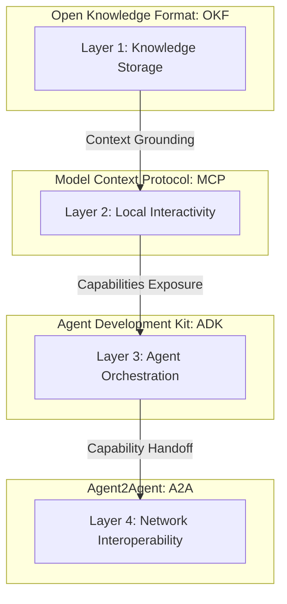
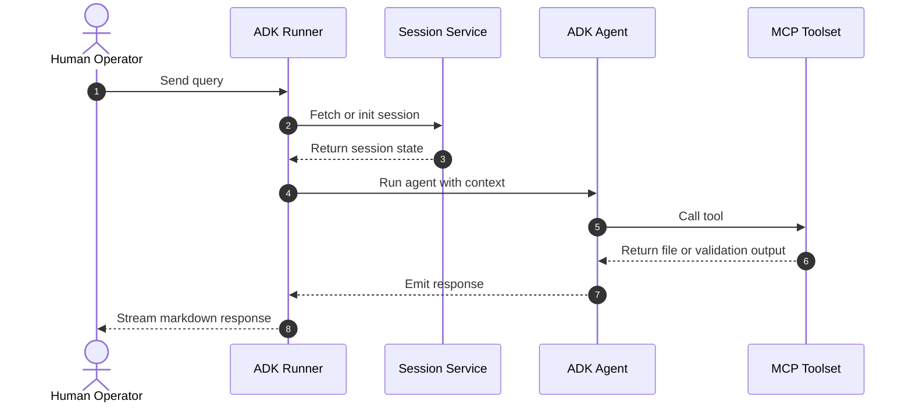

# 008-zarishsphere-monorepo-blueprint.md
## ZarishSphere monorepo architecture, governance, and operational blueprint
### Executive architectural alignment and low-resource hardware specifications — V1 (Vision)

**Document type:** Architecture Blueprint — V1 (Vision)
**Date:** August 01, 2026
**Author:** Mohammad Ariful Islam / ZarishSphere Foundation
**License:** Apache 2.0 (code) · CC BY 4.0 (documentation)
**Status:** V1 — Vision. Parts of this blueprint are superseded by the current architecture.

> **Reading note:** This document is a **vision blueprint** written early in the ecosystem's design. The current, authoritative architecture is the multi-repo structure in → **005-zarishsphere-ecosystem-architecture.md** (single GitHub organization, `zs-docs` as the master documentation repository). The current agent-ecosystem strategy is → **007-zarishsphere-agent-ecosystem-strategy.md**. The binding naming and formatting standard is ZUSS in → **004-zarishsphere-writing-rules.md** — the Open Knowledge Format proposal in §5 below does not supersede it. Read this document for architectural direction; follow 005 and 004 for what is in force.

---

## Table of contents

1. [Purpose and scope](#1-purpose-and-scope)
2. [Executive architectural alignment](#2-executive-architectural-alignment)
3. [Baseline hardware boundaries](#3-baseline-hardware-boundaries)
4. [Static-first governance model](#4-static-first-governance-model)
5. [Open Knowledge Format (OKF) v0.1: historical proposal](#5-open-knowledge-format-okf-v01-historical-proposal)
6. [MCP integration for local AI interactivity](#6-mcp-integration-for-local-ai-interactivity)
7. [ADK and local agent session architecture](#7-adk-and-local-agent-session-architecture)
8. [Agent2Agent (A2A) capability discovery](#8-agent2agent-a2a-capability-discovery)
9. [Separation of concerns: structural zones](#9-separation-of-concerns-structural-zones)
10. [Sandbox environment and validation pipeline](#10-sandbox-environment-and-validation-pipeline)
11. [CI/CD governance and compliance automation](#11-ci-cd-governance-and-compliance-automation)
12. [Implementation checklist](#12-implementation-checklist)

---

## 1. Purpose and scope

This blueprint defines the ZarishSphere monorepo's architecture, governance controls, and operational boundaries for deployment on modest local hardware.

It establishes a single, declarative, static-first workstream for:

- governance and policy documents
- metadata schemas and validation rules
- agent-native tooling and local AI integration
- operational procedures for offline-first environments

> **Constraint:** The monorepo must not require heavy background VMs, proprietary database engines, or memory-intensive orchestration frameworks to provide its governance and validation functionality.

**Vision scope:** This blueprint is one possible future consolidation of the ecosystem. It was written before the multi-repo structure of 005 was adopted. Its hardware, MCP, ADK, and A2A sections remain useful direction; its structural and OKF sections are historical.

## 2. Executive architectural alignment

The ZarishSphere monorepo is aligned with the foundation's core architecture principles:

- **Governance-first:** Every repository, module, and tool path is defined in markdown before any runtime implementation exists.
- **Static source of truth:** All operational state is encoded as flat files rather than a running metadata registry.
- **Offline capability:** The system must work locally on a workstation with intermittent or no internet.
- **Agent-nativity:** Documents are structured for direct consumption by AI agents using MCP.

This architecture is intentionally conservative: it trades dynamic runtime flexibility for deterministic, low-footprint operational safety.

## 3. Baseline hardware boundaries

The ZarishSphere monorepo is designed for the following minimum hardware profile. The processor and memory rows reflect the founder's working machine as recorded in → **003-zarishsphere-founder-profile.md** — a Lenovo laptop with an Intel Core i3 and 8 GB RAM.

| Resource | Baseline target |
|---|---|
| Operating system | Ubuntu 26.04 LTS (primary; Linux-Lite 7.8 or Linux-Mint 22.3 Cinnamon as alternatives) |
| Processor | Intel Core i3 (Lenovo) |
| Memory | 8 GB RAM |
| Graphics | Integrated GPU only |
| Storage | 512 GB SSD |

### 3.1 Resource constraints

- No single background process may consume more than 150 MB of RAM unless explicitly justified by an ADR.
- The governance layer itself must have an idle memory footprint of 0 MB when no active tool is running.
- Runtime services are only launched on demand; static validation and authoring are separate from execution.

### 3.2 Operational implication

The architecture must avoid:

- heavyweight JVM applications (including HAPI FHIR — see → **008-zs-adrs/004-adr-no-hapi-fhir.md**)
- container orchestration platforms such as Kubernetes
- proprietary or commercial database engines as required dependencies
- always-on metadata registries or search indexes that consume persistent RAM

## 4. Static-first governance model

The ZarishSphere monorepo is governed by the discipline of **Documentation as Code**, **Metadata as Code**, **Standards as Code**, and **Diagram as Code**.

### 4.1 Principles

- Every decision must be documented in markdown before it is implemented.
- Every schema and operational rule must be stored as declarative text.
- Every validation rule runs at build-time or on-demand, not as a continually running service.

### 4.2 Architectural statement

By treating the repository as a static graph of text files, the system offloads complexity from runtime to authoring time. The repo itself becomes the active governance asset, and the only persistent service required is a lightweight file-based validator.



## 5. Open Knowledge Format (OKF) v0.1: historical proposal

OKF v0.1 was proposed as the monorepo's canonical content standard.

> **Reconciliation with ZUSS:** OKF v0.1 is a **historical proposal, not a binding standard.** It predates and conflicts with ZUSS (→ **004-zarishsphere-writing-rules.md**). Where the two differ, ZUSS wins:
> - OKF's rule that *every* non-reserved markdown file must begin with YAML front matter is **overridden** by ZUSS rule Z07: Class A documents (governance, architecture, ADRs, SOPs, direction papers) carry the **header block only** and no frontmatter; only Class B structured entries carry YAML frontmatter (ZUSS §6.2).
> - OKF's reserved-file list (`index.md`, `log.md`) is **overridden** by ZUSS §3's tooling-reserved filename table (README.md, LICENSE, CONTRIBUTING.md, CODE_OF_CONDUCT.md, SECURITY.md, CHANGELOG.md, AGENTS.md, TODO.md, llms.txt, mkdocs.yml, .github/**, index.md, SKILL.md).
> - Agent-facing metadata for Class A documents lives in the `.agents` manifest and per-folder `index.md` files, per → **007-zarishsphere-agent-ecosystem-strategy.md** §5.

### 5.1 Original OKF core rules (historical)

- Every non-reserved markdown file must begin with parseable YAML front matter.
- The front matter must include a non-empty `type` or equivalent classification key.
- Reserved files are limited to `index.md` and `log.md`.

### 5.2 Reserved filename semantics (historical)

- `index.md` is a progressive disclosure index and contains no front matter except optional bundle metadata.
- `log.md` is a chronological change history using ISO 8601 date headings. `log.md` is planned tooling — it is not yet implemented.

### 5.3 Monorepo structure model (historical vision)

The conceptual structure for ZarishSphere monorepo governance was:

```text
zarishsphere/
  index.md
  log.md
  001-zs-meta/
  002-zs-foundation/
  003-zs-platform/
  004-zs-index/
  005-zs-standards/
  006-zs-infrastructure/
  007-zs-tech-stack/
  008-zs-adrs/
  009-zs-operations/
  010-zs-ecosystem/
zs-index/
zs-standards/
```

The current structure is the multi-repo layout in → **005-zarishsphere-ecosystem-architecture.md** §3, with `zs-docs` holding `001-zs-meta/` through `010-zs-ecosystem/` and the folder structure preserved.

> **Constraint:** All governance, metadata, and standards assets must remain in open-standard flat files (Markdown, YAML, CSV, JSON) to avoid vendor lock-in. This constraint remains in force.

## 6. MCP integration for local AI interactivity

The Model Context Protocol provides the bridge between static content and active models. Per → **007-zarishsphere-agent-ecosystem-strategy.md** §9, the MCP layer is a future step (Phase 4); the sections below record the design direction.

### 6.1 MCP role

- expose documents as resources
- expose validation and commit operations as tools
- expose reusable prompt templates as prompts

### 6.2 Local MCP server mapping

A minimal MCP server configuration is required for local tooling and editor integrations.

### 6.3 Runtime constraints

- MCP servers must be lightweight and only run when needed.
- No MCP component should require a container runtime.
- MCP services must not keep large indexes in memory; they should stream file content on demand.

## 7. ADK and local agent session architecture

The Agent Development Kit (ADK) coordinates local agent behavior in a memory-efficient way.

### 7.1 Core ADK components

- Agent: system instructions + model + tools
- Session: in-memory, short-lived conversation history
- Runner: execution loop and tool orchestration

### 7.2 Low-resource implementation

ADK-driven workflows must execute in Python or Go whenever possible, avoiding heavyweight runtime stacks.

### 7.3 Example architecture



## 8. Agent2Agent (A2A) capability discovery

A2A enables secure capability sharing across local and networked agents.

### 8.1 Principles

- discovery happens through a well-known agent card
- internal memory is never exposed
- capability publication is declarative and read-only

### 8.2 Standard path

The agent card must be hosted at:

- `/.well-known/agent-card.json`

### 8.3 Capability declaration

The agent card should list supported interfaces and skills in a machine-readable structure.

> **Constraint:** A2A discovery must not expose internal tools, private keys, or local state. Only declared skills and endpoints are publishable.

## 9. Separation of concerns: structural zones

The monorepo is split into three high-level zones for clarity and low-risk operation.

### 9.1 Governance hub

- `zarishsphere/` — system laws, policies, architecture, directory maps, tool contracts

### 9.2 Index engine

- `zs-index/` — metadata ingestion rules, schema catalogs, source taxonomies

### 9.3 Standards engine

- `zs-standards/` — transformation rules, validation contracts, mapping playbooks

### 9.4 Operational separation

This separation prevents validation and governance logic from being mixed with runtime or deployment-specific code.

## 10. Sandbox environment and validation pipeline

A working sandbox on local hardware must be built with the smallest possible footprint.

### 10.1 Local toolchain

- `bash`, `git`, `curl` / `wget`
- `nvm` + Node.js LTS only if required for editors or optional site builds
- `uv` for Python package management
- `python3` for validation scripts and local tool automation

### 10.2 Validation pipeline (planned tooling)

The governance pipeline is a shallow static verification chain. The scripts below are **planned, not yet implemented** — they do not exist in the repository as of this writing.

1. `python3 scripts/010-refresh-files.py`
2. `bash scripts/001-zuss-validate.sh`
3. `bash scripts/002-pipeline-status.sh`
4. `bash scripts/003-resolve-cross-refs.sh`

### 10.3 Build-time assurance

Static documentation and schema compliance are validated before any merge. This keeps the runtime layer minimal and the repository consistently safe. ZUSS §12 defines the validation rules (Z01–Z12) that such a pipeline must check.

## 11. CI/CD governance and compliance automation

Automated verification is the gatekeeper for the master branch.

### 11.1 Requirements

- every push and pull request must run static validation
- no merge without passing the validation pipeline
- no documentation commit without updated `index.md` entries when required

### 11.2 Allowed automation

- GitHub Actions for documentation validation
- lightweight site builds for Markdown rendering checks
- repository-level linting that does not require heavyweight dependencies

> **Constraint:** CI/CD tooling must not introduce new runtime requirements into the production monorepo. It is allowed to use temporary build containers for validation, but the system being governed remains low-resource and static-first.

## 12. Implementation checklist

- [x] Publish `001-zs-meta/008-zarishsphere-monorepo-blueprint.md` as VISION documentation in the GitBook space
- [ ] Update `001-zs-meta/index.md` to expose the blueprint in navigation
- [ ] Confirm `001-zs-meta/007-zarishsphere-agent-ecosystem-strategy.md` and `001-zs-meta/005-zarishsphere-ecosystem-architecture.md` remain cross-referenced (see the reading note above)
- [ ] Keep all new documents compliant with ZUSS naming rules and the Class A / Class B split in → **004-zarishsphere-writing-rules.md** (Z07); OKF v0.1 remains a historical proposal
- [ ] Add `log.md` change-history entries (planned tooling) when implemented
- [ ] Preserve the offline-first, static governance architecture across every new repository or folder

---

*ZarishSphere Foundation · V1 · August 01, 2026*
*License: Apache 2.0 (code) · CC BY 4.0 (documentation)*
*GitHub: https://github.com/zsdotcom*
